# 🤝 Contributing to SolidOS

Thank you for your interest in contributing to SolidOS! This guide contains everything newcomers and current developers need to know to contribute to the SolidOS repositories.

## Table of Contents

- [🙋🏽 How you can contribute](#-how-you-can-contribute)
  - [Writing code](#writing-code)
  - [Builds, CI & releases](#builds-ci--releases)
  - [Writing documentation](#writing-documentation)
  - [Design & UX](#design--ux)
- [🆕 Getting started with the SolidOS code](#-getting-started-with-the-solidos-code)
  - [First time setup](#first-time-setup)
  - [Running SolidOS on localhost](#running-solidos-on-localhost)
  - [Making changes in repos](#making-changes-in-repos)
  - [Developing SolidOS code](#developing-solidos-code)
  - [Testing SolidOS code](#testing-solidos-code)
  - [Build & release](#build--release)
- [🏷️ Ticket labeling](#️-ticket-labeling)
- [📜 Code of conduct](#-code-of-conduct)
- [🎤 Feedback and questions](#-feedback-and-questions)

---

## 🙋🏽 How you can contribute

The SolidOS team is always looking for volunteers to help improve SolidOS. Pull Requests (PRs) and edits are always welcome — from code, to text, to style. We are looking for UX designers, technical writers, frontend developers, backend developers, and DevOps engineers. Don't let these titles intimidate you; they are just some examples. You can find your own place no matter the level of knowledge you are at.

To check for tasks you might help with immediately, look at the [Newcomer View in the Project Board](https://github.com/orgs/SolidOS/projects/1/views/3). You are welcome to visit us at a [weekly team meeting](https://solidos.solidcommunity.net/Team/2021/schedule/solidos-schedule.html) or on the [ongoing Gitter-based chat](https://matrix.to/#/#solid_solidos:gitter.im) to say "Hi" or let us know about any blocker you might have encountered.

### Writing code

We keep track of stuff to do in Git issues of each repo. An [overview](https://github.com/orgs/SolidOS/projects/2/views/2) is available on the project board.

Writing tests as a way to understand the code is always a good idea. Tests, in each repo, should be found in the `test` folder. One can start from there or add new tests.

> **Note:** Please get familiar with [coding guidelines](./documentation/guidelines/coding_guidelines.md) and [testing guidelines](./documentation/guidelines/testing_guidelines.md).

### Builds, CI & releases

There is an existing process and codebase in place to help with SolidOS releases. However, we would like to get better and automate as much as possible. Open issues can be found on the [Project Board](https://github.com/orgs/SolidOS/projects/1/views/4) under the CI category.

> **Note:** Please get familiar with [release guidelines](./documentation/guidelines/dependencies_and_release_guidelines.md).

#### Builds

SolidOS contains different repositories (mashlib, solid-logic, solid-ui, solid-panes, ...). Each repository contains a `package.json` with `scripts`. All repos contain an `npm run build` which is used to build the project.

#### Testing & releasing a new SolidOS version

In SolidOS, you will find `bash scripts` under [scripts](https://github.com/solidos/solidos/tree/main/scripts) which are related to releasing a new SolidOS stack. The [release script](https://github.com/solidos/solidos/blob/main/scripts/release) is also used to update dependencies in each repo.

Following best practices, we deploy the new version on our test server:
NSS https://pivot-test.solidproject.org:8443
Pivot/CSS subdomain https://pivot-test.solidproject.org:3000
Pivot/CSS suffix https://pivot-test.solidproject.org:3100

#### Deployment on solidcommunity.net server

Deployment to solidcommunity.net is exclusively done by ODI. 

### Writing documentation

SolidOS has quite some documentation around that needs constant improvement.
Places to start:

- For how SolidOS works, [visit the user guide](https://github.com/solidos/userguide) and the [SolidOS project Pod](https://solidos.solidcommunity.net/)
- [SolidOS FAQs](https://github.com/solidos/solidos/wiki/FAQs)
- [SolidOS Wiki](https://github.com/solidos/solidos/wiki)

We are open to suggestions to improve these resources — from structure and translation to UI and content in general.

### Design & UX

[Solid-ui](https://github.com/solidos/solid-ui) does the heavy lifting for all things UI in SolidOS.
Currently, we use [Storybook](https://storybook.js.org/) to help develop components independent of other panes. Make sure to visit the [solid-ui readme](https://github.com/solidos/solid-ui) for information on how to set it up and get started.

There is a second option to run solid-ui on its own. Read about it at [Debugging solid-ui using Solid Pane Tester](https://github.com/solidos/solidos/wiki/1.-SolidOS-know-how#debugging-solid-ui-using-solid-pane-tester).

You can also find current issues at [solid-ui issues](https://github.com/solidos/solid-ui/issues) and more information at the [SolidOS Wiki](https://github.com/solidos/solidos/wiki/2.-Solid-UI-know-how).

---

## 🆕 Getting started with the SolidOS code

Before you start coding, please review our guidelines:

- [Coding guidelines](./documentation/guidelines/coding_guidelines.md)
- [Testing guidelines](./documentation/guidelines/testing_guidelines.md)
- [Dependency and release guidelines](./documentation/guidelines/dependencies_and_release_guidelines.md)

### First time setup

Make sure you have the needed environment: [nvm for SolidOS](https://github.com/solidos/solidos/wiki/FAQs#setting-up-nvm-to-develop-for-solidos), npm, and Node.

```sh
git clone https://github.com/solidos/solidos
cd solidos
npm run setup
```

> **Note:** It might prompt you to install a specific `node` version, something like `nvm install xxx # version missing mentioned in console log`.

> **Note:** In case of errors, try to follow what the output messages (errors) suggest in the console to fix the problems, and let us know on the [SolidOS team chat](https://matrix.to/#/#solid_solidos:gitter.im).

Run the above lines in a terminal of your choice to set up your SolidOS project folder. By default, some dependent repos are also set up for you:

- [rdflib.js](https://github.com/linkeddata/rdflib.js) — Javascript RDF library for browsers and Node.js
- [solid-logic](https://github.com/solidos/solid-logic) — core business logic of SolidOS
- [pane-registry](https://github.com/solidos/pane-registry) — an index to hold all loaded solid panes
- [mashlib](https://github.com/solidos/mashlib/) — a solid-compatible code library of application-level functionality for the world of Solid
- [solid-panes](https://github.com/solidos/solid-panes) — a set of core solid-compatible panes based on solid-ui
- [solid-ui](https://github.com/solidos/solid-ui) — User Interface widgets and utilities for Solid. Building blocks for solid-based apps
- [node-solid-server](https://github.com/solid/node-solid-server) — the server that allows you to test your changes

You can start your server and test out your code with:

```sh
npm start-pivot
```

This will start [pivot](https://github.com/solid-contrib/pivot), a flavour of the COmmunity Solid Server.

If you get into problems, check out [SolidOS FAQs](https://github.com/solidos/solidos/wiki/FAQs) or ask us directly at [SolidOS team chat](https://matrix.to/#/#solid_solidos:gitter.im).

> **Note:** The NPM scripts use `bash` scripts. These might not work if you're developing on a Windows machine. Let us know on the [SolidOS team chat](https://matrix.to/#/#solid_solidos:gitter.im) if you want support for this.

### Running SolidOS on localhost

Once you managed to get SolidOS running locally (`npm start`) you can see it at `https://localhost:3100/`. If you encounter any problems, check the [Troubleshooting SolidOS page](https://github.com/solidos/solidos/wiki/Troubleshooting-SolidOS).

To work on localhost, first you need to register a local user — hit `register` on `https://localhost:3100/.account/`. After you have created your user, you can navigate to your new pod at `https://username.localhost:3100/`.

Whenever you need to log in again, remember to put `https://localhost:3100/` in the `Enter the URL of your identity provider:` input field. Otherwise you will be logged in with a different provider and redirected out of the localhost environment.

### Making changes in repos

As a newcomer, you do not have direct access to the repos, but you can still contribute through Pull Requests (PRs). First, navigate to the repo you want to work on, and create a fork. Make your changes on your fork, and then create a PR. We will be notified and you will receive feedback on your changes. For more details, visit the [GitHub documentation on creating a pull request](https://docs.github.com/en/pull-requests/collaborating-with-pull-requests/proposing-changes-to-your-work-with-pull-requests/creating-a-pull-request).

If you do have direct access to the repos, it is usual to create a branch for your changes and then a PR. A PR helps you receive feedback and lets us know easily about any changes to the code.

Make sure to read more about working with branches and missing repos at the [SolidOS Wiki](https://github.com/solidos/solidos/wiki/1.-SolidOS-know-how#dealing-with-github-branches).

### Developing SolidOS code

Very likely you will want to make changes in the dependent packages/repos of SolidOS (mashlib, solid-logic, solid-ui, solid-panes...).

You have two choices:

- [Work directly in SolidOS](#work-directly-in-solidos)
- [Work in the according dependent package](#work-in-the-according-dependent-package)

#### Work directly in SolidOS

The `npm start-pivot` script contains a lerna command: `npx lerna bootstrap --force-local` which makes sure that packages are bootstrapped/taken from your local machine even if versions don't match.

If you need to bootstrap any packages again (e.g. you've run `npm install` in any of the projects) and don't want to stop the server, you can do `npx lerna bootstrap --force-local` only. You do not need to stop the server and start it again (`npm start-pivot`).

Another option is to start SolidOS with the `npm run watch-pivot` script. This triggers the watch-script for mashlib, solid-ui, and solid-panes. If you want to run the watch-script for rdflib or any of the panes, you'll have to add them to the watch script you are using.

The output for the watch-script can be a bit difficult to interpret since all output for mashlib, solid-ui, and solid-panes are presented in the same window. You might also consider having each watch script running in a separate terminal window. The downside of this approach is that at its worst, you'll have five separate watch-scripts running (in addition to the terminal window where you started the server) when working on a pane that needs to pick up a change in rdflib. If you find this unwieldy for your setup, or it requires too many resources, you should consider to [work in the according dependent package](#work-in-the-according-dependent-package).

#### Work in the according dependent package

Any changes you do in a project need to be committed to their original repos and eventually be pushed to NPM manually (this is the part of Lerna that we do not use for this project).

Some projects require you to build a package before you can see changes, so check the various `package.json` files to see which scripts are available. You can usually do `npm run build`, and some also support `npm run watch` which builds a new version each time you make a local change.

Be aware, the packages depend on one another. Here's a simplified view of the dependencies:

```
pivot --> rdflib
pivot --> mashlib --> rdflib
pivot--> mashlib --> solid-panes --> rdflib
pivot --> mashlib --> solid-panes --> solid-ui --> rdflib
pivot --> mashlib --> solid-panes --> [pane project] --> solid-ui --> rdflib
```

This means that if you do a change in solid-panes and want to see the result on your local pivot, you need to make sure that mashlib compiles the changes as well. Similarly, if you do changes to solid-ui, and some pane relies on those changes, you need to make sure that the pane compiles those changes, that solid-panes compiles the changes from the pane, and finally that mashlib compiles the changes from solid-panes. This quickly becomes hard to track, so we've devised a couple of ways to mitigate this.

Read in detail how each pane can be debugged at the [SolidOS Wiki](https://github.com/solidos/solidos/wiki/1.-SolidOS-know-how#debugging-panesrepos-standalone-without-running-whole-solidos).

### Testing SolidOS code

Most of the modules in SolidOS have a `test` script which can be called with `npm run test`.
In some cases the tests run an [ESLint](https://eslint.org/) command `eslint 'src/**/*.ts'` or a [jest](https://jestjs.io/) test or both.

Jest can also offer information related to test coverage by simply running `npm run test-coverage`.

You can find a repo's tests usually in a dedicated folder called `test`.

### Build & release

The SolidOS code stack build and release are [described above](#builds-ci--releases).

---

## 🏷️ Ticket labeling

To keep our work organized and transparent, we use a structured ticket workflow. Every issue goes through the following lifecycle stages:



| State | Description | Transition in | Transition out |
|---|---|---|---|
| **Backlog** | Item hasn't been started | New issue created | Picked up |
| **In progress** | Actively being worked on | Picked up / Changes requested / QA failed | PR submitted |
| **In review** | Item is under review | PR submitted | PR approved for merge / Changes requested |
| **Ready** | On test server, awaits QA | PR approved for merge | QA passed / QA failed |
| **Done** | Completed | QA passed | — |

**Workflow transitions:**

1. A **new issue** is created and lands in **Backlog**.
2. When someone picks it up, they move the ticket to **In progress**.
3. Once a PR is submitted, they move the ticket to **In review**.
4. If **changes are requested** during review, the reviewer puts the ticket back to **In progress**.
5. When the PR is approved for merge, the reviewer moves the ticket to **Ready** (it will be deployed to the test server, awaits QA).
6. If **QA fails**, the tester puts the ticket back to **In progress**.
7. When **QA passes**, the item is marked **Done**.

---

## 📜 Code of conduct

Please read and follow the community [Solid Code of Conduct](https://github.com/solid/process/blob/main/code-of-conduct.md).

---

## 🎤 Feedback and questions

Don't hesitate to [chat with us on Gitter](https://matrix.to/#/#solid_solidos:gitter.im) or [report a bug](https://github.com/solidos/solidos/issues).
