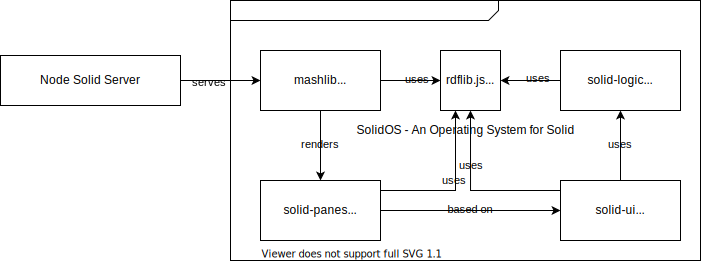
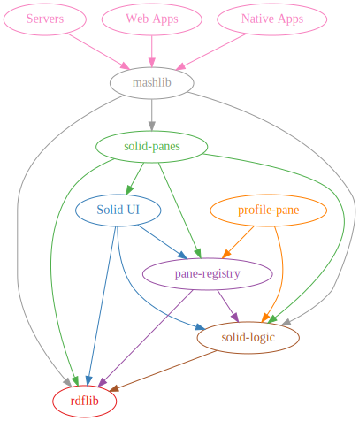

# 🤗 Welcome to the repo of SolidOS


[](https://github.com/solidos/solidos/blob/main/LICENSE.md)
[](https://github.com/solidos/solidos/issues)
[](https://gitter.im/solid/solidos)

If you made it here you must already have heard about [Solid](https://solidproject.org).
This space is home to the SolidOS code. Keep reading if you want to know:

- 🤔 [What is SolidOS](#-What-is-SolidOS)
  - [What you can do today with SolidOS](#What-you-can-do-today-with-SolidOS)
  - [SolidOS vision, mission and roadmap](#solidos-vision-mission-and-roadmap)
- 👩🏽‍💻 [SolidOS technical intro](#-solidos-technical-intro)
  - [SolidOS deeper technical topics](#solidos-deeper-technical-topics)
- 👯 [How the SolidOS team works](#-How-the-SolidOS-team-works)
  - [SolidOS team meetings](#SolidOS-team-meetings)
  - [SolidOS team instant chat](#SolidOS-team-instant-chat)
  - [SolidOS team discussions](#SolidOS-team-discussions)
  - [SolidOS tasks](#SolidOS-tasks)
- 🙋🏻 [How you can contribute and help SolidOS thrive](#-How-you-can-contribute-and-help-SolidOS-thrive)
  - [For anyone up to writing some code](#For-anyone-up-to-writing-some-code)
  - [For anyone who likes builds or releases or GitHub CI or deployments](#for-anyone-who-likes-builds-or-github-ci-or-releases-or-deployments)
  - [For anyone who likes writing text](#For-anyone-who-likes-writing-text)
  - [For anyone with an eye for design](#For-anyone-with-an-eye-for-design)
- 🆕 [Getting started with the SolidOS code](#-Getting-started-with-the-SolidOS-code)
  - [SolidOS first time setup of code](#SolidOS-first-time-setup-of-code)
  - [How to use SolidOS on localhost](#How-to-use-SolidOS-on-localhost)
  - [How to make changes in repos](#How-to-make-changes-in-repos)
  - [Developing SolidOS code](#Developing-SolidOS-code)
  - [Testing SolidOS code](#Testing-SolidOS-code)
  - [SolidOS build & release](#SolidOS-build-and-release)
- 📜 [License](#-License)
- 🎤 [Feedback and questions](#-Feedback-and-questions)

For experimenting with SolidOS implementations, you can:

- try SolidOS on a [test-pod](https://test-pod.solidcommunity.net:8443/) (provider: `https://solidcommunity.net:8443`, user and password: `test-pod`)
- take a pod on <https://solidcommunity.net> or [another provider](https://solidproject.org/users/get-a-pod#get-a-pod-from-a-pod-provider)
- check out the [SolidOS WebApp](https://solidos.github.io/mashlib/dist/browse.html)
- use as a stand-alone desktop app with [Data-Kitchen](https://github.com/solidos/data-kitchen)

If you are looking for something else, let us try and guide you:

- for learning about Solid, read [about Solid](https://github.com/solid/solid) and visit [solidproject.org](https://solidproject.org)
- to try out Solid, head over to [getting started with Solid](https://solidproject.org/developers/tutorials/getting-started)
- for how SolidOS works, [visit the user guide](https://github.com/solidos/userguide) and [SolidOS project Pod](https://solidos.solidcommunity.net/)
- for how the community works, go over to [Solid process](https://github.com/solid/process)
- chat with others about Solid on the [forum](https://forum.solidproject.org/) and on [instant chats](https://gitter.im/solid/home)
- join an event over at [Solid events](https://solidproject.org/events) or sign up for the [Solid newsletter](https://solidproject.org/newsletter) to not miss any news
- read the Solid community code of conduct at [Solid CoC](https://github.com/solid/process/blob/main/code-of-conduct.md)

Further links:

- [SolidOS explanation video](https://vimeo.com/643594034#t=9m39s)
- [SolidOS goals & roadmap](https://solidos.solidcommunity.net/Team/docs/SolidOSNorthStar.html)
- [SolidOS FAQs](https://github.com/solidos/solidos/wiki/FAQs)
- [SolidOS Wiki](https://github.com/solidos/solidos/wiki)
- [SolidOS Guidelines](./documentation/guidelines/)
- report a problem with SolidOS by [creating a git issue](https://github.com/solidos/solidos/issues)
- have a new idea? Create a Solid [user story/new idea ticket](https://github.com/solid/user-stories)
- check out the in-progress [Solid specification](https://solidproject.org/TR/protocol) and in-progress [Solid specification repo](https://solid.github.io/specification/). Find the previous specifications, now outdated but still in use if you work with NSS: [https://github.com/solid/solid-spec](https://github.com/solid/solid-spec).
- [Glossary](https://github.com/solid/solidcommunity.net/wiki/Glossary) of terms frequently used in Solid environment

## 🤔 What is SolidOS?

_**🌟🌟🌟 SolidOS is an Operating System for Solid. 🌟🌟🌟**_

[Solid](https://solidproject.org) is developing into a booming ecosystem which involves specifications 📃, tech stack 🛠, servers 💻, and apps 🕹. We, the SolidOS team, believe that this ecosystem also needs an Operating System.

When you get a new phone, PC, or tablet, they usually come with an operating system that provides some basic functionality to get started and be productive. More importantly, you can personalize your OS to your needs, by installing apps, managing content, and much more.

Solid is not shipped with a piece of hardware (who knows, maybe in the future it will...). For now, you get into the ecosystem once you create a WebID and provision your own personal data store (often called a "Pod") ([see getting started with Solid - get a pod](https://solidproject.org/users/get-a-pod#get-a-pod-from-a-pod-provider)). Immediately after getting your new Solid WebID and Pod space, SolidOS is helping you to navigate the Solid ecosystem.

SolidOS is much more. SolidOS showcases the possibility of [Solid](https://solidproject.org) for the future, by which we mean —

- **true data ownership** — management of personal data & authorization control
- **avoidance of vendor lock-in to services** — easy moving to a different Pod or WebID provider
- **data reuse between applications** — with help of data interoperability and data discoverability

Watch a [SolidOS explanation video](https://vimeo.com/643594034#t=9m39s) as part of the [Solid World event series](https://solidproject.org/events).

### What you can do today with SolidOS

Take a look at an example: [SolidOS project Pod](https://solidos.solidcommunity.net/). SolidOS implemented features:

- 📰 create a personal webpage
- 📝 manage your WebID and the data about yourself
- 📝 manage personal data/files on your Pod
- 🤝 directly connect and engage with other people who are part of the ecosystem (add friends, chat, ...)
- 💡 make use of interconnected apps
- 🔧 create your own app [with Inrupt's Solid Reach SDK](https://docs.inrupt.com/developer-tools/javascript/react-sdk/application/) or [get inspired from a blog post](https://solidos.solidcommunity.net/public/2021/BuildingSolidAppsUsingPublicData-V3.html)
- and more ([see SolidOS user guide](https://github.com/solidos/userguide))

### SolidOS vision, mission and roadmap

Read more about the current SolidOS 🌟 vision, goals 🎯, and roadmap 🚗 on the [SolidOS project Pod](https://solidos.solidcommunity.net/Team/docs/SolidOSNorthStar.html).

_**Note:** SolidOS is also known by names like Data Browser (default) or Databrowser, and at times as mashlib._ Which name is used depends on which flavour of SolidOS you are referring to:

- The SolidOS Databrowser Frontend - a frontend for Solid Servers like [solidcommunity.net](https://solidcommunity.net), represented by this codebase;
- The SolidOS Databrowser Webapp - a stand-alone web app served from mashlib: [https://solidos.github.io/mashlib/dist/browse.html](https://solidos.github.io/mashlib/dist/browse.html);
- The SolidOS Data-Kitchen - a stand-alone desktop app: [https://github.com/solidos/data-kitchen](https://github.com/solidos/data-kitchen);
- The SolidOS software stack - a set of libraries that may be used independently of the databrowser, see next section.

## 👩🏽‍💻 SolidOS technical intro

The SolidOS stack contains —

- [Node.js](https://nodejs.dev/)
- [Javascript](https://www.w3schools.com/js/)
- [Typescript](https://www.typescriptlang.org/)
- [npm](https://www.npmjs.com/)
- [Node Version Manager (nvm)](https://github.com/nvm-sh/nvm)
- [Lerna](https://lerna.js.org/)
- [GitHub CI](https://docs.github.com/en/actions/automating-builds-and-tests/about-continuous-integration)
- [bash scripts](https://www.gnu.org/software/bash/manual/html_node/index.html)

It also makes use of —

- [Storybook](https://storybook.js.org/)
- [Webpack](https://webpack.js.org/)
- [Jest](https://jestjs.io/)
- [Cypress](https://www.cypress.io/)
- [ESLint](https://eslint.org/)
- [Babel](https://babeljs.io/)
- [Travis](https://travis-ci.org/)

Let's take a look at an architecture diagram of SolidOS:


A colorful dependency tree can be seen here:


As you can see, SolidOS is composed of several repositories:

- [**rdflib.js**](https://github.com/linkeddata/rdflib.js) — Javascript RDF library for browsers and Node.js
- [**solid-logic**](https://github.com/solidos/solid-logic) — core business logic of SolidOS
- [**mashlib**](https://github.com/solidos/mashlib/) — a solid-compatible code library of application-level functionality for the world of Solid
- [**solid-panes**](https://github.com/solidos/solid-panes) — a set of core solid-compatible panes based on solid-ui
- [**solid-ui**](https://github.com/solidos/solid-ui) — User Interface widgets and utilities for Solid. Building blocks for solid-based apps

In the above diagram, SolidOS is deployed on the [Node Solid Server (NSS)](https://github.com/solid/node-solid-server), but it can also be set up to run on the [Community Solid Server (CSS)](https://github.com/CommunitySolidServer) or on ANY Solid-compliant server. When you download and compile the SolidOS code, an NSS is also installed locally, to have everything ready to develop.

### SolidOS deeper technical topics

For further details about each GitHub repository, please visit them via the links above for `Documentation`.

We collect SolidOS code good practices and know how in [SolidOS documentation pages](https://github.com/solidos/solidos/tree/main/documentation).

[SolidOS FAQs](https://github.com/solidos/solidos/wiki/FAQs) part of the [SolidOS developer guide](https://github.com/solidos/solidos/wiki) also contains some Q&A and technical troubleshooting infos.

## 👯 How the SolidOS team works

First and foremost who are the contributors of SolidOS?

The SolidOS codebase has a long history and there have been a lot of contributors over the years (see: [GitHub contributors](https://github.com/solidos/solidos/graphs/contributors)). The most active team members are mentioned in the SolidOS Team on the [SolidOS Pod Contacts](https://solidos.solidcommunity.net/Contacts/).

### SolidOS team meetings

The SolidOS team meets every week for a 1h touchdown. We discuss what was done over the past week, what needs to be done next, and delegation of tasks. Find the meeting time and link on the [SolidOS project Pod](https://solidos.solidcommunity.net/Team/2021/schedule/solidos-schedule.html).

We take minutes on our meetings. You can find them on the [SolidOS pod](https://solidos.solidcommunity.net/public/SolidOS%20team%20meetings/).

### SolidOS team instant chat

In between team meetings, we avidly communicate over at the [gitter SolidOS channel](https://gitter.im/solid/solidos). Drop by to chat with us, ask questions, or simply say "Hi".

### SolidOS team discussions

Sometimes some ideas need an incubation period and further discussion. We make use of [GitHub discussions](https://github.com/solidos/solidos/discussions) for that.

### SolidOS tasks

For daily tasks, we have a [Project Board](https://github.com/orgs/SolidOS/projects/1) with different views.

For a longer-term roadmap, we use a [Solid task manager](https://solidos.solidcommunity.net/public/Roadmap/Tasks/), and plan the next milestones on Kanban.

### Additional useful information

- Find answers over at [SolidOS FAQs](https://github.com/solidos/solidos/wiki/FAQs) or at the [SolidOS Wiki](https://github.com/solidos/solidos/wiki).
- For an overall description of how the whole ecosystem works head over to [solid process](https://github.com/solid/process).
- Make sure to get into discussions on the [forum](https://forum.solidproject.org/) and on Solid [instant chat channels](https://gitter.im/solid/home).
- Join an event over at [Solid events](https://solidproject.org/events) or sign up for the [Solid newsletter](https://solidproject.org/newsletter) to not miss any news
- Read the community code of conduct [Solid CoC](https://github.com/solid/process/blob/main/code-of-conduct.md).

## 🙋🏽‍ How you can contribute and help SolidOS thrive

The SolidOS team is always looking for volunteers to help improve SolidOS. Pull Requests (PRs) and edits are always welcome from code, to text, to style. We are looking for UX designers, technical writers, frontend developers, backend developers, DevOps. Don't let these titles intimidate you; they are just some examples. You can find your own place no matter the level of knowledge you are at.

To check possible tasks you can help with immediately, look on the [Newcomer View in the Project Board](https://github.com/orgs/SolidOS/projects/1/views/3). You are welcome to visit us on a [weekly team meeting](https://solidos.solidcommunity.net/Team/2021/schedule/solidos-schedule.html) or on the [instant chat](https://gitter.im/solid/solidos) and say 'Hi' or let us know about any blocker you might have.

### For anyone up to writing some code

We keep track of stuff to do in Git issues of each repo. [An overview](https://github.com/orgs/SolidOS/projects/1/views/4) you can find on the project board.

Writing tests as a way to understand the code is always a good idea. Tests, in each repo, should be found in the `test` folder. One can start from there or/and add tests.

_**Note:** Please get familiar with [coding](./documentation/guidelines/coding_guidelines.md) and [testing](./documentation/guidelines/testing_guidelines.md) guidelines._

### For anyone who likes builds or GitHub CI or releases or deployments

There is a process and code in place to help with SolidOS releases. However, we would like to get better and automate as much as possible. Open issues can be found on the [Project Board](https://github.com/orgs/SolidOS/projects/1/views/4) under the CI category.

_**Note:** Please get familiar with [release guidelines](./documentation/guidelines/dependencies_and_release_guidelines.md)._

#### Builds

SolidOS contains different repositories (mashlib, solid-logic, solid-ui, solid-panes, ...). Each repository contains a `package.json` with `scripts`. Most repos contain an `npm run build` which is used to build the project.

#### GitHub CI

When you push or PR a change to a repo, a git CI is activated and runs every time. An example is the [solid-panes workflow](https://github.com/solidos/solid-panes/blob/main/.github/workflows/ci.yml). This CI YML can contain instructions to test and build the repo on different Node versions. If upon push or PR, an instruction fails, one should take care to fix it and keep the branches green.

#### Testing & releasing a new SolidOS version

In SolidOS, you will find a `bash scripts` under [scripts](https://github.com/solidos/solidos/tree/main/scripts) which is related to releasing a new SolidOS stack. The [release script](https://github.com/solidos/solidos/blob/main/scripts/release) is also used to update dependencies in each repo.

Following best practices, we deploy the new version on the [testserver](https://solidcommunity.net:8443/) as mentioned [here](https://github.com/solid/solidcommunity.net/wiki#solidcommunitynet8443-test-server-instance).

#### Deployment on solidcommunity.net server

Before you start, make sure you have access to all the GitHub repos and all the `npm` packages. Using Ubuntu or other Unix-like OS, `ssh` into the server as `root`.

```sh
tmux new
adduser --shell /bin/bash --home /home/build --ingroup sudo build
su - build
whoami
sudo whoami
```

Then:

```s
curl -o- https://raw.githubusercontent.com/nvm-sh/nvm/v0.37.0/install.sh | bash
export NVM_DIR="$([ -z "${XDG_CONFIG_HOME-}" ] && printf %s "${HOME}/.nvm" || printf %s "${XDG_CONFIG_HOME}/nvm")"
[ -s "$NVM_DIR/nvm.sh" ] && \. "$NVM_DIR/nvm.sh" # This loads nvm
nvm install 16
nvm use 16

ssh-keygen -t ed25519 -C "michiel+build@unhosted.org"
git config --global user.name "Solid OS Build (Michiel)"
git config --global user.email "michiel+build@unhosted.org"
cat .ssh/id_ed25519.pub
npm login
```

Log in to npm with your npm account and add the SSH public key to your GitHub account. Then continue:

```sh
git clone https://github.com/solidos/solidos
cd solidos
npm run install-nvm
npm run release
```

More information can be also found over at the [server, solidcommunity.net, repo](https://github.com/solid/solidcommunity.net/wiki).

### For anyone who likes writing text

SolidOS has quite some documentation around that needs constant improvement.
Places to start:

- for how SolidOS works [visit the user guide](https://github.com/solidos/userguide) and [SolidOS project Pod](https://solidos.solidcommunity.net/);
- [SolidOS FAQs](https://github.com/solidos/solidos/wiki/FAQs);
- [SolidOS Wiki](https://github.com/solidos/solidos/wiki).

We are open to suggestions to improve these resources from structure, translation, UI to content in general.

### For anyone with an eye for design

[Solid-ui](https://github.com/solidos/solid-ui) does the heavy lifting to all things UI for SolidOS.
Currently, we use [Storybook](https://storybook.js.org/) to help develop components independent of other panes. Make sure to visit the [solid-ui readme](https://github.com/solidos/solid-ui) for information on how to set it up and get started.
There is a second option to run solid-ui on its own. Read about it at [Debugging solid-ui using Solid Pane Tester](https://github.com/solidos/solidos/wiki/1.-SolidOS-know-how#debugging-solid-ui-using-solid-pane-tester).

You can also find the current issues over at the [solid-ui issues](https://github.com/solidos/solid-ui/issues). And some more information over at the [SolidOS Wiki](https://github.com/solidos/solidos/wiki/2.-Solid-UI-know-how).

SolidOS needs a lot of improvements on UI, including UX and style-guides. Maybe you are the one who can help out? Visit the [Project Board](https://github.com/orgs/SolidOS/projects/1/views/4) and look for UX and UI categories.

## 🆕 Getting started with the SolidOS code

Before you get started with coding please visit our guidelines:

- [coding guidelines](./documentation/guidelines/coding_guidelines.md);
- [testing guidelines](./documentation/guidelines/testing_guidelines.md);
- [dependency and release guidelines](./documentation/guidelines/dependencies_and_release_guidelines.md).

### SolidOS first time setup of code

Make sure you have the needed environment: [nvm for SolidOS](https://github.com/solidos/solidos/wiki/FAQs#setting-up-nvm-to-develop-for-solidos), npm, Node. If you have problems with node versions on the Apple M1 chip, in the [Troubleshooting SolidOS](https://github.com/solidos/solidos/wiki/Troubleshooting-SolidOS) you can find a solution.

```
git clone https://github.com/solidos/solidos
cd solidos
npm run setup
```

_**Note:** It might prompt you to install a dedicated node version, somthing like `nvm install xxx # version missing mentioned in console log`._

_**Note:** In case of errors try to follow what the output messages (errors) suggest in the console to fix the problems. And write us up on [SolidOS team chat](https://gitter.im/solid/solidos)._

Run the above lines in a terminal of your choice to setup your SolidOS project folder. By default, some dependent repos are also set up for you:

- [rdflib.js](https://github.com/linkeddata/rdflib.js): Javascript RDF library for browsers and Node.js
- [solid-logic](https://github.com/solidos/solid-logic): core business logic of SolidOS
- [pane-registry](https://github.com/solidos/pane-registry): an index to hold all loaded solid panes
- [mashlib](https://github.com/solidos/mashlib/): a solid-compatible code library of application-level functionality for the world of Solid
- [solid-panes](https://github.com/solidos/solid-panes): a set of core solid-compatible panes based on solid-ui
- [solid-ui](https://github.com/solidos/solid-ui): User Interface widgets and utilities for Solid. Building blocks for solid-based apps
- [node-solid-server](https://github.com/solid/node-solid-server): the server that allows you to test your changes

You can start your server and test out your code with:

```
npm start
```

If you get into problems check out [SolidOS FAQs](https://github.com/solidos/solidos/wiki/FAQs) or ask us directly at [SolidOS team chat](https://.im/solid/solidos).

_**Note:** The NPM scripts are using `bash` scripts. These might not work if you're developing on a Windows machine. Let us know, over at [SolidOS team chat](https://gitter.im/solid/solidos) if you want support for this._

### How to use SolidOS on localhost

Once you managed to get SolidOS running locally (`npm start`) you can see it over at `https://localhost:8443/`. If you encounter any problems make sure to check the [Troubleshooting SolidOS page](https://github.com/solidos/solidos/wiki/Troubleshooting-SolidOS).

To work on localhost, first you need to register a local user, so hit `register` on `https://localhost:8443/`. After you have created your user, you can navigate to your new pod over at `https://username.localhost:8443/`.
Whenever you need to login again, remember to put `https://localhost:8443/` in the `Enter the URL of your identity provider:` input field. Otherwise you will be logged in with a different provider and redirected out of the localhost environment.

### How to make changes in repos

As a newcomer, you do not have direct access to the repos, but you can still contribute through Pull Requests (PRs). First, navigate to the repo you want to work on, and create a fork. Make your changes on your fork, and then create a PR. We will be notified, and you will receive feedback on your changes. For more details on how to do this, visit [the GitHub documentation](https://docs.github.com/en/pull-requests/collaborating-with-pull-requests/proposing-changes-to-your-work-with-pull-requests/creating-a-pull-request), which explains it much better than we ever could.

If you do have direct access to the repos, it is usual to create a branch for your changes and then a PR. A PR helps you receive feedback and lets us know easily about any changes to the code. Read more about Pull Requests over at the GitHub documentation.

Make sure to read more about working with branches and missing repos over at the [SolidOS Wiki](https://github.com/solidos/solidos/wiki/1.-SolidOS-know-how#dealing-with-github-branches).

### Developing SolidOS code

Very likely you will want to make changes in the dependent packages/repos of SolidOS (mashlib, solid-logic, solid-ui, solid-panes...).

You have two choices:

- [work directly in SolidOS](#Work-directly-in-SolidOS)
- [work in the according dependent package](#Work-in-the-according-dependent-package)

#### Work directly in SolidOS

The `npm start` script contains a lerna command: `npx lerna bootstrap --force-local` which makes sure that packages are bootstrapped/taken from your local machine even if versions don't match.

If you need to bootstrap any packages again (e.g. you've run `npm install` in any of the projects) and don't want to stop the server, you can do `npx lerna bootstrap --force-local` only. You do not need to stop the server and start it again (`npm start`).

Another option is to start SolidOS with the `npm run watch` script. This triggers the watch-script for mashlib, solid-ui, and solid-panes. If you want to run watch-script for rdflib or any of the panes, you'll have to open another terminal window, navigate to the respective project and start its watch-script doing `npm run watch`.

The output for the watch-script can be a bit difficult to interpret since all output for mashlib, solid-ui, and solid-panes are presented in the same window. You might also consider having each watch scripts running in a separate terminal window. The downside of using this approach is that at its worst, you'll have five separate watch-scripts running (in addition to the terminal window where you started the server) when working on a pane that needs to pick up a change in rdflib. If you find this unwieldy for your setup, or require too many resources, you should consider to [work in the according dependent package](#Work-in-the-according-dependent-package).

#### Work in the according dependent package

Any changes you do in a project need to be committed to their original repos and eventually be pushed to NPM manually (this is the part of Lerna that we do not use for this project).

Some projects require you to build a package before you can see changes, so check the various package.json files to see which scripts are available. You can usually do `npm run build`, and some also support `npm run watch` which builds a new version each time you do a local change.

Be aware, the packages depend on one another. Here's a simplified view of the dependencies:

```
node-solid-server --> rdflib
node-solid-server --> mashlib --> rdflib
node-solid-server --> mashlib --> solid-panes --> rdflib
node-solid-server --> mashlib --> solid-panes --> solid-ui --> rdflib
node-solid-server --> mashlib --> solid-panes --> [pane project] --> solid-ui --> rdflib
```

This means that if you do a change in solid-panes and want to see the result on your local NSS, you need to make sure that mashlib compiles the changes as well. Similarly, if you do changes to solid-ui, and some pane relies on those changes, you need to make sure that the pane compiles those changes, that solid-panes compiles the changes from the pane, and finally that mashlib compiles the changes from solid-panes. This quickly becomes hard to track, so we've devised a couple of ways to mitigate this.

Read about in detail how each pane can be debugged over at the [SolidOS Wiki](https://github.com/solidos/solidos/wiki/1.-SolidOS-know-how#debugging-panesrepos-standalone-without-running-whole-solidos).

### Testing SolidOS code

Most of the modules in SolidOS have a `test` script which can be called with `npm run test`.
In some cases the tests run an [ESLint](https://eslint.org/) command `eslint 'src/**/*.ts'` or a [jest](https://jestjs.io/) test or both.

Jest can also offer information related to test coverage by simply runnig `npm run coverage`.

You can find a repo's tests usually in a dedicated folder called `test`.

### SolidOS build and release

The SolidOS code stack build and release are [described above](#For-anyone-who-likes-builds-or-GitHub-CI-or-releases-or-deployments).

## 📜 License

The SolidOS code is available under the MIT License.

## 🎤 Feedback and questions

Don't hesitate to [chat with us on gitter](https://gitter.im/solid/home) or [report a bug](https://github.com/solidos/solidos/issues).
