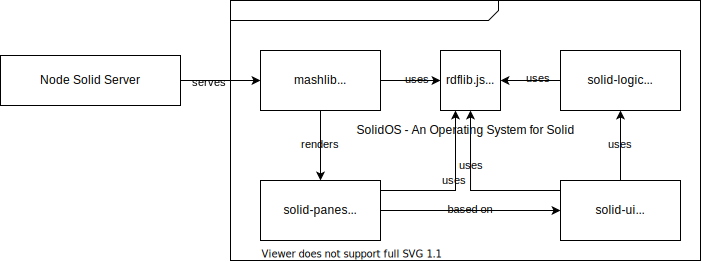
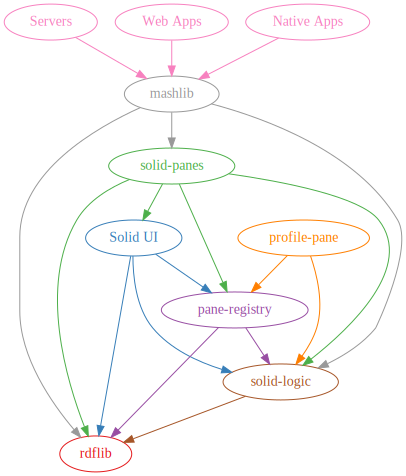

# 🤗 Welcome to the repo of SolidOS

<mark>NEW<mark> 

The refactoring of the SolidOS UI is [funded](https://nlnet.nl/project/SolidDataModules/) by 
/ 
[Read more](https://github.com/SolidOS/solidos/tree/main/NLNetFunding)

If you made it here you must already have heard about [Solid](https://solidproject.org).
This space is home to the SolidOS code. Keep reading if you want to know:

- 🤔 [What is SolidOS](#-What-is-SolidOS)
  - [What you can do today with SolidOS](#What-you-can-do-today-with-SolidOS)
  - [SolidOS vision, mission and roadmap](#solidos-vision-mission-and-roadmap)
- 👩🏽‍💻 [SolidOS technical intro](#-solidos-technical-intro)
  - [SolidOS deeper technical topics](#solidos-deeper-technical-topics)
- 👯 [How the SolidOS team works](#-How-the-SolidOS-team-works)
  - [Team meetings](#SolidOS-team-meetings)
  - [Instant chat](#SolidOS-team-instant-chat)
  - [Discussions](#SolidOS-team-discussions)
  - [Tasks & project board](#SolidOS-tasks)
- 🙋🏻 [How you can contribute and help SolidOS thrive](./CONTRIBUTING.md)
  - [Writing code](./CONTRIBUTING.md#writing-code)
  - [Builds, CI & releases](./CONTRIBUTING.md#builds-ci--releases)
  - [Writing documentation](./CONTRIBUTING.md#writing-documentation)
  - [Design & UX](./CONTRIBUTING.md#design--ux)
- 🆕 [Getting started with the SolidOS code](#-Getting-started-with-the-SolidOS-code)
  - [First time setup](#SolidOS-first-time-setup-of-code)
  - [Running SolidOS on localhost](#How-to-use-SolidOS-on-localhost)
  - [Making changes in repos](#How-to-make-changes-in-repos)
  - [Developing SolidOS code](#Developing-SolidOS-code)
  - [Testing SolidOS code](#Testing-SolidOS-code)
  - [Build & release](#SolidOS-build-and-release)
- 📜 [License](#-License)
- 🎤 [Feedback and questions](#-Feedback-and-questions)

For experimenting with SolidOS implementations, you can:

- try SolidOS on a [test-pod](https://test-pod.solidcommunity.net:8443/) (provider: `https://solidcommunity.net:8443`, user and password: `test-pod`)
- take a pod on <https://solidcommunity.net> or [another provider](https://solidproject.org/users/get-a-pod#get-a-pod-from-a-pod-provider)
- check out the [SolidOS WebApp](https://solidos.github.io/mashlib/dist/browse.html)
- use as a stand-alone desktop app with [Data-Kitchen](https://github.com/solidos/data-kitchen)

If you are looking for something else, let us try and guide you:

- for learning about Solid, read [about Solid](https://github.com/solid/solid) and visit [solidproject.org](https://solidproject.org)
- to try out Solid, head over to [getting started with Solid](https://solidproject.org/developers/tutorials/getting-started)
- for how SolidOS works, [visit the user guide](https://github.com/solidos/userguide) and [SolidOS project Pod](https://solidos.solidcommunity.net/)
- for how the community works, go over to [Solid process](https://github.com/solid/process)
- chat with others about Solid on the [forum](https://forum.solidproject.org/) and on [instant chats](https://gitter.im/solid/home)
- join an event over at [Solid events](https://solidproject.org/events) or sign up for the [Solid newsletter](https://solidproject.org/newsletter) to not miss any news
- read the Solid community code of conduct at [Solid CoC](https://github.com/solid/process/blob/main/code-of-conduct.md)

Further links:

- [SolidOS explanation video](https://vimeo.com/643594034#t=9m39s)
- [SolidOS goals & roadmap](https://solidos.solidcommunity.net/Team/docs/SolidOSNorthStar.html)
- [SolidOS FAQs](https://github.com/solidos/solidos/wiki/FAQs)
- [SolidOS Wiki](https://github.com/solidos/solidos/wiki)
- [SolidOS Guidelines](./documentation/guidelines/)
- report a problem with SolidOS by [creating a git issue](https://github.com/solidos/solidos/issues)
- have a new idea? Create a Solid [user story/new idea ticket](https://github.com/solid/user-stories)
- check out the in-progress [Solid specification](https://solidproject.org/TR/protocol) and in-progress [Solid specification repo](https://solid.github.io/specification/). Find the previous specifications, now outdated but still in use if you work with NSS: [https://github.com/solid/solid-spec](https://github.com/solid/solid-spec).
- [Glossary](https://github.com/solid/solidcommunity.net/wiki/Glossary) of terms frequently used in Solid environment

## 🤔 What is SolidOS?

_**🌟🌟🌟 SolidOS is an Operating System for Solid. 🌟🌟🌟**_

[Solid](https://solidproject.org) is developing into a booming ecosystem which involves specifications 📃, tech stack 🛠, servers 💻, and apps 🕹. We, the SolidOS team, believe that this ecosystem also needs an Operating System.

When you get a new phone, PC, or tablet, they usually come with an operating system that provides some basic functionality to get started and be productive. More importantly, you can personalize your OS to your needs, by installing apps, managing content, and much more.

Solid is not shipped with a piece of hardware (who knows, maybe in the future it will...). For now, you get into the ecosystem once you create a WebID and provision your own personal data store (often called a "Pod") ([see getting started with Solid - get a pod](https://solidproject.org/users/get-a-pod#get-a-pod-from-a-pod-provider)). Immediately after getting your new Solid WebID and Pod space, SolidOS is helping you to navigate the Solid ecosystem.

SolidOS is much more. SolidOS showcases the possibility of [Solid](https://solidproject.org) for the future, by which we mean —

- **true data ownership** — management of personal data & authorization control
- **avoidance of vendor lock-in to services** — easy moving to a different Pod or WebID provider
- **data reuse between applications** — with help of data interoperability and data discoverability

Watch a [SolidOS explanation video](https://vimeo.com/643594034#t=9m39s) as part of the [Solid World event series](https://solidproject.org/events).

### What you can do today with SolidOS

Take a look at an example: [SolidOS project Pod](https://solidos.solidcommunity.net/). SolidOS implemented features:

- 📰 create a personal webpage
- 📝 manage your WebID and the data about yourself
- 📝 manage personal data/files on your Pod
- 🤝 directly connect and engage with other people who are part of the ecosystem (add friends, chat, ...)
- 💡 make use of interconnected apps
- 🔧 create your own app [with Inrupt's Solid Reach SDK](https://docs.inrupt.com/developer-tools/javascript/react-sdk/application/) or [get inspired from a blog post](https://solidos.solidcommunity.net/public/2021/BuildingSolidAppsUsingPublicData-V3.html)
- and more ([see SolidOS user guide](https://github.com/solidos/userguide))

### SolidOS vision, mission and roadmap

Read more about the current SolidOS 🌟 vision, goals 🎯, and roadmap 🚗 on the [SolidOS project Pod](https://solidos.solidcommunity.net/Team/docs/SolidOSNorthStar.html).

_**Note:** SolidOS is also known by names like Data Browser (default) or Databrowser, and at times as mashlib._ Which name is used depends on which flavour of SolidOS you are referring to:

- The SolidOS Databrowser Frontend - a frontend for Solid Servers like [solidcommunity.net](https://solidcommunity.net), represented by this codebase;
- The SolidOS Databrowser Webapp - a stand-alone web app served from mashlib: [https://solidos.github.io/mashlib/dist/browse.html](https://solidos.github.io/mashlib/dist/browse.html);
- The SolidOS Data-Kitchen - a stand-alone desktop app: [https://github.com/solidos/data-kitchen](https://github.com/solidos/data-kitchen);
- The SolidOS software stack - a set of libraries that may be used independently of the databrowser, see next section.

## 👩🏽‍💻 SolidOS technical intro

The SolidOS stack contains —

- [Node.js](https://nodejs.dev/)
- [Javascript](https://www.w3schools.com/js/)
- [Typescript](https://www.typescriptlang.org/)
- [npm](https://www.npmjs.com/)
- [Node Version Manager (nvm)](https://github.com/nvm-sh/nvm)
- [Lerna](https://lerna.js.org/)
- [GitHub CI](https://docs.github.com/en/actions/automating-builds-and-tests/about-continuous-integration)
- [bash scripts](https://www.gnu.org/software/bash/manual/html_node/index.html)

It also makes use of —

- [Storybook](https://storybook.js.org/)
- [Webpack](https://webpack.js.org/)
- [Jest](https://jestjs.io/)
- [Cypress](https://www.cypress.io/)
- [ESLint](https://eslint.org/)
- [Babel](https://babeljs.io/)
- [Travis](https://travis-ci.org/)

Let's take a look at an architecture diagram of SolidOS:

A colorful dependency tree can be seen here:

As you can see, SolidOS is composed of several repositories:

- [**rdflib.js**](https://github.com/linkeddata/rdflib.js) — Javascript RDF library for browsers and Node.js
- [**solid-logic**](https://github.com/solidos/solid-logic) — core business logic of SolidOS
- [**mashlib**](https://github.com/solidos/mashlib/) — a solid-compatible code library of application-level functionality for the world of Solid
- [**solid-panes**](https://github.com/solidos/solid-panes) — a set of core solid-compatible panes based on solid-ui
- [**solid-ui**](https://github.com/solidos/solid-ui) — User Interface widgets and utilities for Solid. Building blocks for solid-based apps

In the above diagram, SolidOS is deployed on the [Node Solid Server (NSS)](https://github.com/solid/node-solid-server), but it can also be set up to run on the [Community Solid Server (CSS)](https://github.com/CommunitySolidServer) or on ANY Solid-compliant server. When you download and compile the SolidOS code, an NSS is also installed locally, to have everything ready to develop.

### SolidOS deeper technical topics

For further details about each GitHub repository, please visit them via the links above for `Documentation`.

We collect SolidOS code good practices and know how in [SolidOS documentation pages](https://github.com/solidos/solidos/tree/main/documentation).

[SolidOS FAQs](https://github.com/solidos/solidos/wiki/FAQs) part of the [SolidOS developer guide](https://github.com/solidos/solidos/wiki) also contains some Q&A and technical troubleshooting infos.

---

## 👯 How the SolidOS team works

First and foremost — who are the contributors of SolidOS?

The SolidOS codebase has a long history and there have been a lot of contributors over the years (see: [GitHub contributors](https://github.com/solidos/solidos/graphs/contributors)). The most active team members are mentioned in the SolidOS Team on the [SolidOS Pod Contacts](https://solidos.solidcommunity.net/Contacts/).

### Team meetings

The SolidOS team meets every week for a 1h touchdown. We discuss what was done over the past week, what needs to be done next, delegation of tasks, and talk about technical aspects. Find the meeting time and link on the [SolidOS project Pod](https://solidos.solidcommunity.net/Team/team%20meetings/schedule.html).

We take minutes on our meetings. You can find them on the [SolidOS pod](https://solidos.solidcommunity.net/public/SolidOS%20team%20meetings/).

### Instant chat

In between team meetings, we avidly communicate over at the [Matrix SolidOS channel](https://matrix.to/#/#solid_solidos:gitter.im). Drop by to chat with us, ask questions, or simply say "Hi".

### Discussions

Sometimes some ideas need an incubation period and further discussion. We make use of [GitHub discussions](https://github.com/solidos/solidos/discussions) for that.

### Tasks & project board

For daily tasks, we have a [Project Board](https://github.com/orgs/SolidOS/projects/2/views/12) with different views.

For a longer-term roadmap, we use a [Solid task manager](https://solidos.solidcommunity.net/public/Roadmap/Tasks/), and plan the next milestones on Kanban.

**Additional useful links:**

- [SolidOS FAQs](https://github.com/solidos/solidos/wiki/FAQs) and the [SolidOS Wiki](https://github.com/solidos/solidos/wiki)
- [Solid process](https://github.com/solid/process) — overall description of how the whole ecosystem works
- [Forum](https://forum.solidproject.org/) and Solid [instant chat channels](https://matrix.to/#/#solid_project:matrix.org)
- [Solid events](https://solidproject.org/events) and the [Solid newsletter](https://solidproject.org/newsletter)

---

## 🙋🏽‍ How you can contribute and help SolidOS thrive

For information about contributing, team processes, code and docs workflows, and local development, please see [CONTRIBUTING.md](./CONTRIBUTING.md).

## 📜 License

The SolidOS code is available under the MIT License.

## 🎤 Feedback and questions

Don't hesitate to [chat with us on gitter](https://gitter.im/solid/home) or [report a bug](https://github.com/solidos/solidos/issues).
